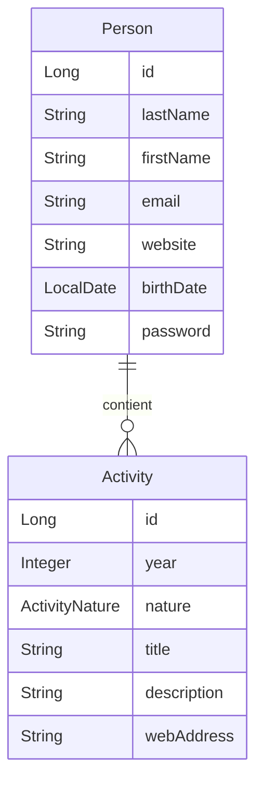

<div align="center">

# Skillfolio Backend

### Backend Spring Boot pour gérer un profil, un CV structuré et ses activités


</div>

---

## Présentation

**Skillfolio Backend** est une base d'application Spring Boot conçue pour gérer un profil personnel et son parcours sous forme de CV structuré.

Le projet modélise une personne, ses informations principales et une liste d'activités associées : expériences, formations, projets ou autres éléments de parcours. L'objectif est de poser un socle backend propre, testable et extensible pour une application de portfolio/CV dynamique.

Le dépôt se concentre actuellement sur la couche domaine, la persistance JPA et les tests repository. Il constitue une fondation technique sur laquelle peuvent ensuite être ajoutés des contrôleurs REST, une couche service, une authentification complète et une interface frontend.

---

## Stack technique

| Couche | Technologies |
|---|---|
| Langage | Java 21 |
| Framework | Spring Boot 3.5.5 |
| Persistance | Spring Data JPA, Hibernate |
| Base de données | HSQLDB en mémoire |
| Validation | Jakarta Bean Validation |
| Tests | JUnit 5, Spring Boot Test, AssertJ |
| Build | Maven Wrapper |
| Packaging | WAR |
| Web | Spring MVC, WebFlux présents dans les dépendances |
| Sécurité | Spring Security présent dans les dépendances |

---

## Fonctionnalités actuelles

- Gestion d'une entité `Person` représentant un profil.
- Gestion d'une entité `Activity` représentant un élément du CV.
- Classification des activités par nature : expérience, formation, projet ou autre.
- Relation `Person` → `Activity` avec cascade et suppression orpheline.
- Validation des champs métier avec Jakarta Validation.
- Repositories Spring Data JPA pour les opérations CRUD.
- Tests d'intégration sur la persistance des personnes et des activités.
- Base HSQLDB en mémoire pour un démarrage simple en local.

---

## Modèle de domaine



### `Person`

L'entité `Person` représente le profil principal du portfolio.

Champs principaux :

- `firstName` : prénom obligatoire.
- `lastName` : nom obligatoire.
- `email` : email obligatoire, unique et validé.
- `website` : site personnel ou portfolio.
- `birthDate` : date de naissance.
- `password` : mot de passe avec une taille minimale de 8 caractères.
- `cv` : liste des activités associées au profil.

La relation avec les activités est configurée en `OneToMany` avec :

- `cascade = CascadeType.ALL` pour propager les opérations sur les activités liées ;
- `orphanRemoval = true` pour supprimer une activité retirée du CV ;
- `mappedBy = "person"` pour indiquer que l'entité `Activity` porte la clé étrangère.

### `Activity`

L'entité `Activity` représente une ligne de parcours.

Champs principaux :

- `year` : année de l'activité.
- `nature` : type d'activité via l'énumération `ActivityNature`.
- `title` : titre obligatoire.
- `description` : description longue, limitée à 2000 caractères en base.
- `webAddress` : lien associé à l'activité.
- `person` : profil auquel l'activité appartient.

La relation avec `Person` est configurée en `ManyToOne(fetch = FetchType.LAZY)` afin d'éviter de charger le profil complet inutilement à chaque lecture d'activité.

### `ActivityNature`

```java
public enum ActivityNature {
    EXPERIENCE,
    FORMATION,
    PROJET,
    AUTRE
}
```

Cette énumération permet de catégoriser proprement les éléments du CV sans stocker de texte libre fragile en base.

---

## Architecture du projet

```txt
skillfolio-backend-main/
├── pom.xml
├── mvnw
├── mvnw.cmd
├── src/
│   ├── main/
│   │   ├── java/app/
│   │   │   ├── Starter.java
│   │   │   ├── dao/
│   │   │   │   ├── ActivityRepository.java
│   │   │   │   └── PersonRepository.java
│   │   │   └── model/
│   │   │       ├── Activity.java
│   │   │       ├── ActivityNature.java
│   │   │       └── Person.java
│   │   └── resources/
│   │       ├── application.properties
│   │       ├── messages.properties
│   │       ├── messages_fr.properties
│   │       └── static/
│   │           ├── favicon.ico
│   │           └── style.css
│   └── test/
│       └── java/app/dao/
│           ├── ActivityRepositoryTest.java
│           └── PersonRepositoryTest.java
└── target/
```

---

## Choix techniques

### Persistance avec Spring Data JPA

Les repositories héritent de `JpaRepository`, ce qui permet de disposer immédiatement des opérations CRUD classiques :

- création ;
- lecture par identifiant ;
- mise à jour ;
- suppression ;
- pagination et tri si nécessaire par la suite.

```java
@Repository
@Transactional
public interface PersonRepository extends JpaRepository<Person, Long> {
}
```

Le projet reste volontairement simple côté repository pour l'instant : aucune requête custom n'est nécessaire tant que le périmètre métier reste centré sur la création et la consultation de profils et d'activités.

### Validation métier au niveau des entités

Les contraintes `@NotBlank`, `@NotNull`, `@Email` et `@Size` permettent de documenter et sécuriser les règles minimales du modèle :

```java
@NotBlank
@Email
@Column(unique = true, nullable = false)
private String email;
```

Cette approche garantit que les données invalides sont détectées tôt, avant leur propagation dans la couche de persistance.

### Base de données en mémoire

La configuration actuelle utilise HSQLDB en mémoire :

```properties
spring.datasource.url=jdbc:hsqldb:mem:mydb;shutdown=true
```

C'est adapté pour un projet de démonstration, des tests ou un prototype local. Pour un usage réel, une base persistante comme PostgreSQL serait plus appropriée.

### Tests d'intégration repository

Les tests chargent le contexte Spring avec `@SpringBootTest` et vérifient les opérations principales sur les repositories.

Couverture actuelle :

- création et lecture d'une personne ;
- mise à jour d'une personne ;
- suppression d'une personne ;
- création et lecture d'une activité liée à une personne ;
- mise à jour d'une activité ;
- suppression d'une activité.

Chaque test est annoté avec `@Transactional`, ce qui permet de garder un état de base propre entre les scénarios.

---

## Configuration

Le fichier principal de configuration se trouve ici :

```txt
src/main/resources/application.properties
```

Configuration actuelle :

```properties
server.port=8081

spring.mvc.view.prefix: /WEB-INF/jsp/
spring.mvc.view.suffix: .jsp

spring.datasource.driver-class-name=org.hsqldb.jdbcDriver
spring.datasource.url=jdbc:hsqldb:mem:mydb;shutdown=true
spring.datasource.username=SA
spring.datasource.password=

application.message: Hello World!

spring.main.allow-circular-references = true
spring.profiles.active=open
```

Le projet contient aussi des fichiers `messages.properties` et `messages_fr.properties`, ce qui prépare l'application à l'internationalisation.

---

## Installation

### Prérequis

- Java 21
- Git
- Maven Wrapper fourni dans le projet

Vérifier la version de Java :

```bash
java -version
```

### Cloner le projet

```bash
git clone <url-du-repo>
cd skillfolio-backend-main
```

### Rendre le wrapper Maven exécutable si nécessaire

```bash
chmod +x mvnw
```

### Installer les dépendances et compiler

```bash
./mvnw clean install
```

---

## Lancer l'application

```bash
./mvnw spring-boot:run
```

L'application démarre sur :

```txt
http://localhost:8081
```

À ce stade du projet, aucune route métier REST ou page JSP n'est encore exposée dans le code source. Le démarrage permet surtout de vérifier la configuration Spring Boot, le contexte applicatif, les entités JPA et la connexion à la base en mémoire.

---

## Lancer les tests

```bash
./mvnw test
```

Les tests actuels valident la couche repository :

```txt
PersonRepositoryTest
├── testCreateAndReadPerson
├── testUpdatePerson
└── testDeletePerson

ActivityRepositoryTest
├── testCreateAndReadActivity
├── testUpdateActivity
└── testDeleteActivity
```


